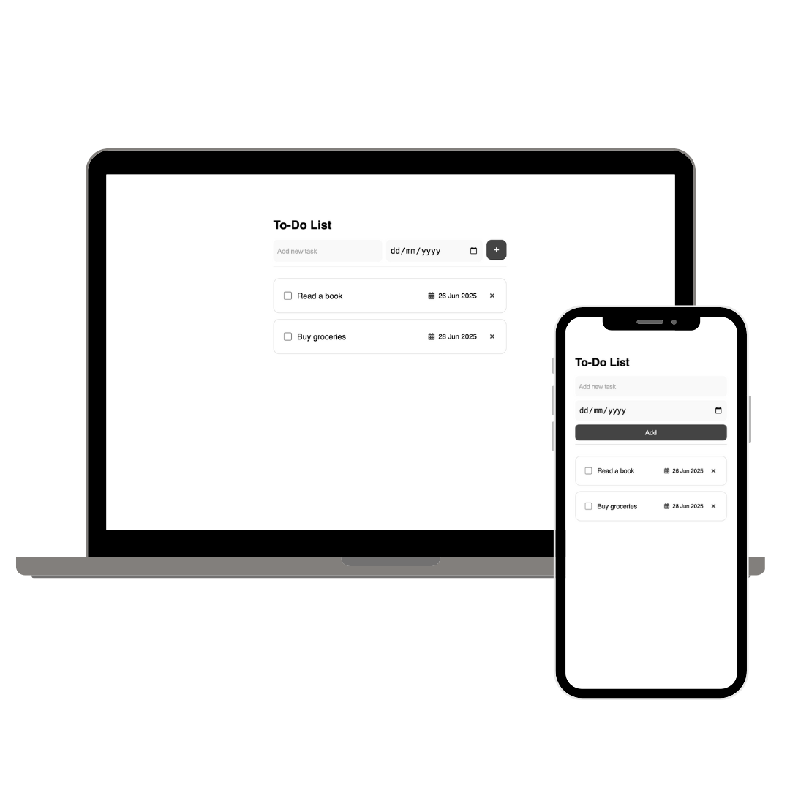

# ✅ Vue 3 To-Do List

A minimalist and responsive To-Do List app built with **Vue 3** and **Vite**.  
Easily manage tasks with due dates, toggle their completion, and enjoy a clean UI with mobile-friendly design.



---

## ✨ Features

- Built using **Vue 3 Composition API**
- Add, complete, and remove tasks
- Set due dates with a custom calendar icon
- Responsive form layout (mobile & desktop)
- Clean UI with a focus on simplicity
- Empty state message when no tasks available
- Keyboard-friendly and accessible

---

## 🛠 Project Setup

### Install dependencies

```bash
npm install
```

## 🛠 Project Commands

### Start development server with hot reload

```bash
npm run dev
```